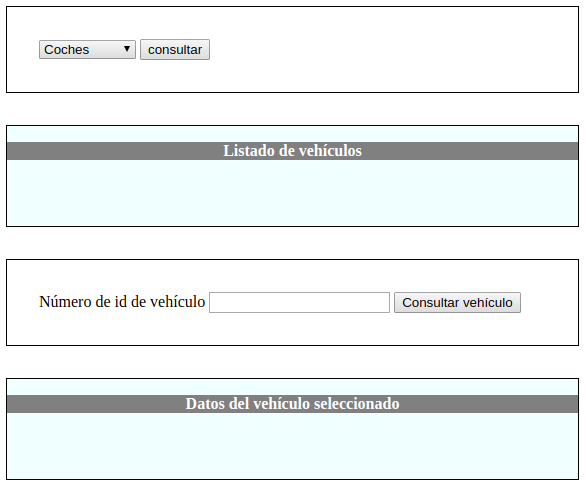

# AJAX

Tal y como W3Schools afirma, AJAX es un sueño para los programadores, porque:
- Actualiza una página sin tener volver a cargarla
- Solicita datos del servidor, después de que la página se haya cargado
- Recibe datos desde el servidor, después de que la página se haya cargado
- Se comunica con el servidor en segundo plano

## Enviando una solicitud al servidor mediante AJAX

### 1. Inicialización de la solicitud HTTP
```
var xhrequest = new XMLHttpRequest();
xhrequest.open('GET', 'send-ajax-data.php');
```
### 2. Definición de la función *callback*

Antes de realizar la solicitud, hay que decile al objeto XMLHttpRequest qué debe hacer cuando llegue la respuesta. Esto se hace mediante la propiead *onreadystatechange*.

```
xhrequest.onreadystatechange = nombreFuncionCallback
```
La función *nombreFuncionCallback* contendrá un código como el siguiente:
```
if (xhrequest.readyState == 4 && xhrequest.status == "200") {
    // HACER ALGO CON LOS DATOS RECIBIDOS: xhrequest.responseText
} else {
	// HUBO UN ERROR
}
```
El atributo *readyState* puede tener diferentes valores, dependiendo del estado de la conexión. La siguiente tabla lo muestra:

| Value |	State	            |   Description |
|-------|-----------------------|----------------|
|0	    |  UNSENT	            |   An XMLHttpRequest object has been created, but the open() method hasn't been called yet (i.e. request not initialized).|
|1	    |  OPENED	            |   The open() method has been called (i.e. server connection established).|
|2	    |  HEADERS_RECEIVED	    |   The send() method has been called (i.e. server has received the request).|
|3	    |  LOADING	            |   The server is processing the request.|
|4	    |  DONE	                |   The request has been processed and the response is ready.|

Por otra parte, el atributo *status* hace referencia al código de estado de la cabecera HTTP recibida desde el servidor: [Descripción de estados HTTP en mozilla.org](https://developer.mozilla.org/en-US/docs/Web/HTTP/Status)

### 3. Envío de la solicitud

```
xhrequest.send();

```
-----------------------------

**Actividad 1.** Una página permite consultar vehículos en un depósito de embargos. Los vehículos pueden ser:
- Coches
- Barcos
- Motocicletas
El proceso funciona en dos pasos. En un primer formulario, se consultan todos los vehículos de un cierto tipo, mostrando una lista de número de identificación. En el segundo formulario se consultan los datos del vehículo a partir su número de identificación. 

Los datos asociados a un vehículo son similares a los siguientes:
- Tipo: coche
- Nº de id: X33F132A-Z
- Propietario: Juan José Antúnez
- DNI: 55667788C
- Estado: embargado

La página podría tener un aspecto como el siguiente:



NOTA: Los estados posibles son "embargado", "pendiente de subasta" y "vendido"

Utiliza AJAX para resolver el problema. 


### 4. Objetos en JavaScript

JavaScript incluye diferentes notaciones para crear clases y objetos:

#### 4.1 Creación clásica de objetos mediante funciones

```
function Book (type, author) {
    this.type = type;
    this.author = author;
    this.getDetails = function () {
        return this.type + " written by " + this.author;
    }
}

var book = new Book("Fiction", "Peter King");
alert(book.getDetails());

```

Se pueden usar prototipos para ahorrar memoria, de manera que no se vuelva a declarar la función cada vez que se crea un nuevo objeto.

```
function Book (type, author) {
    this.type = type;
    this.author = author;
    this.prototype.getDetails = function () {
        return this.type + " written by " + this.author;
    }
}

var book = new Book("Fiction", "Peter King");
alert(book.getDetails());

```

#### 4.2 Creación de objetos mediante JSON (JavaScript Object Notation)

```
var circle = {
    radius : 10,
    area : function() { 
       return Math.PI * this.radius * this.radius; 
    }
};
alert(circle.area());
alert(typeof circle.area);
```

#### 4.3 Creación de objetos con declaración de clase
```
 class Car {
  constructor(brand) {
    this.carname = brand;
  }

  present() {
    return "I have a " + this.carname;
  }
}

mycar = new Car("Ford");
document.getElementById("demo").innerHTML = mycar.present();

```

### 5. Para enviar información mediante AJAX por POST se puede utilizar la notación JSON. En el servidor se recibirá un array asociativo con los campos definidos en el objeto de javascript.

```
var jsonEnviado = {valor1: "valor1", valor2: 2}

var xhrequest = new XMLHttpRequest();
xhrequest.open("POST", url, true);
xhrequest.setRequestHeader('Content-type','application/json; charset=utf-8');

xhrequest.onreadystatechange = function () {
	if (xhrequest.readyState == 4 && xhrequest.status == "200") {
	    var JSONrecibido = JSON.parse(xhrequest.responseText);	// El servidor también puede devolver un objeto JSON
        // ... hacer algo con el objeto recibido
	} else {
		console.log("Se produjo un error de comunicación");
	}
}

xhrequest.send(jsonEnviado)
```

### 6. Recogida en PHP de un objeto JSON enviado por POST en una solicitud AJAX
```
    $data = file_get_contents('php://input');
    $data = json_decode($data,true); // $data contiene un array asociativo.
```

### 7. Envío de un objeto JSON desde PHP
```
    header("Content-Type: application/json");
    $json = json_encode($data);
    echo $json
```
----------
**Actividad 2.** Escribe una pequeña aplicación web que calcule equivalencias entre centímetros y pulgadas. En una página html se mostrará una entrada de texto y un par de botones de radio que incluirán los textos "De cm a pulgadas" y "De pulgadas a cm". Además, hay un botón que activa el envío mediante AJAX de los valores del formulario al servidor. En el servidor se reciben los datos y se calcula la equivalencia y la resupuesta es enviada de vuelta a la página html, donde se mostrará el resultado mediante un cadena de texto del tipo:
"3 cm son 1.1811 pulgadas"

**Actividad 3.** Vuelve a realizar la actividad 1, pero usando en este caso el método POST, y objetos de JavaScript.

**Actividad 4.** Escribe una página con una estructura similar a la siguiente:


En el campo de texto *tecnología* se puedan introducir nombres de tecnologías. Estos nombres se van enviando al backend, que los guarda en la base de datos. Después, en el siguiente formulario, se puede insertar el nombre de un curso, y la tecnología que incluye. En el menú desplegable se ofrecerán las opciones incluidas en el campo *tecnología*. Cada nuevo curso que se vaya agregando, debe registrarse en una base de datos, y apareciendo en la parte inferior de la página.

# Apéndices

## Genaración de archivos PDF desde el servidor con FPDF - Generar documentos PDF

La documentación de FPDF está en [http://www.fpdf.org/](http://www.fpdf.org/)
El siguiente fragmento contiene código para generar un PDF:

```
<?php
require "fpdf.php";

class CreaPdf extends FPDF
{
    function Header()
    {
        $this->Image('politecnico-malaga.jpg',160,8,33);
        $this->SetFont('Arial','B',15);
        $this->Cell(80,10,'',1);
        $this->Cell(30,10,utf8_decode('Título'),1,0,'C');
        $this->Ln(20);
    }

    function Footer(){
        $this->SetY(-15);
        $this->SetFont('Arial','I',8);
        $this->Cell(0,10,'Page '.$this->PageNo().'/{nb}',0,0,'C');
    }
}

$pdf = new CreaPdf();
$pdf->AliasNbPages();
$pdf->AddPage();
$pdf->SetFont('Courier','B',14);
$pdf->Cell(0,10,'Un título');
$pdf->Ln(40);
$pdf->SetFont('Times','',12);
for($i=1;$i<=40;$i++)
    $pdf->Cell(0,10,utf8_decode('Imprimiendo línea número ').$i,1,1);

header('Content-type: application/pdf');
header('Content-Disposition: attachment; filename="myPDF.pdf');
header('Cache-Control: private');
header('Pragma: private');
header('Expires: Mon, 26 Jul 1997 05:00:00 GMT');

$pdf->Output();
```

El fragmento donde generamos el documento PDF debe ser una clase que extiende a la clase FPDF.
```
class CreaPdf extends FPDF
```
En la clase *FPDF* están definidos los métodos *Header* y *Footer* aunque están vacíos. Por eso, hay que implementarlos.
Los métodos más importantes son los siguientes:
- *Image(string file [, float x [, float y [, float w [, float h [, string type [, mixed link]]]]]])*: Sirve para insertar una imagen. Sólo hace falta indicar el ancho, y se reajusta la altura propoorcionalmente.
- *Cell(float w [, float h [, string txt [, mixed border [, int ln [, string align [, boolean fill [, mixed link]]]]]]])*: Sirve para incluir una celda (que contiene texto).
    - Valores posibles de *border*
        - 0: sin borde
        - 1: con borde
        - L: izquierda
        - T: superior
        - R: derecha
        - B: inferior
    - Valores posibles de *ln*: indica dónde debe empezar una celda.
        - 0: a continuación.
        - 1: en la siguiente línea.
        - 2: debajo
    - Valores posibles de *align*: 
        - L: alineación izquierda.
        - C: alineación centrada.
        - R: alineación derecha.
    - Valores posibles de *fill*:Indica si el fondo de la celda debe ser dibujada o no.
        - true
        - false
    - Valores posibles de *link*: URL

> Se pueden utilizar complementariamente los comandos *SetFillColor* y *SetTextColor*

- *SetFont(string family [, string style [, float size]])*: si se incluye antes de *Cell* se puede modificar el tipo de letra.
    - Valores posibles de *family*
        - Courier (fixed-width)
        - Helvetica o Arial (sinónimo; sans serif)
        - Times (serif)
        - Symbol (symbolic)
        - ZapfDingbats (symbolic)  
    - Valores posibles de *style*
        - cadena vacia: regular
        - B: bold
        - I: italic
        - U: underline
    - *size*: tamaño en puntos
- *AddPage([string orientation [, mixed size [, int rotation]]])*: Añade una nueva página al documento. Si la página ya está presente, el método Footer() es invocado primero para producir el pie de página. Entonces es añadida la página, la posición actual se establece en la esquina superior izquierda de acuerdo a los márgenes izquierda y superior, y el Header() es invocado para mostrar el encabezado.
    - Valores posibles de *orientation*:
        - P: Portrait
        - L: Landscape
    - Valores posibles de *size*:
        - A3
        - A4
        - A5
        - Letter
        - Legal
    - rotation: ángulo de rotación (múltiplo de 90)

> NOTA: El origen del sistema de coordenadas es la esquina superior izquierda y se incrementan hacia abajo.

- *Ln([float h])*: Ejecuta un salto de línea, donde h es la altura del salto. Por defecto, si *h* no se especifica mide lo mismo que la última celda impresa.

- *AliasNbPages([string alias])*: Define un alias para el número total de páginas. Se sustituira en el momento que el documento se cierre. El valor por defecto es *{nb}*. Por ejemplo, el siguiente fragmento imprime el número de página y el total en formato 3/10.

```
        $this->Cell(0,10,'Page '.$this->PageNo().'/{nb}',0,0,'C');
```


## Descarga de archivos mediante enventos, con AJAX.

Es similar a cualquier llamada *AJAX* aunque con algunas diferencias:

```
    var d = document.getElementById("d");
    const xhRec = new XMLHttpRequest();
    d.addEventListener("click",downloadFile);

    function downloadFile(a){
        xhRec.responseType = "blob";
        xhRec.onload = descargar;
        xhRec.open("GET","descargar.php");
        xhRec.setRequestHeader('Accept','image/jpeg');
        xhRec.send();
    }

    function descargar(ev){
        const type = xhRec.getResponseHeader('Content-Type');
        const datos = xhRec.response;
        const blob = new Blob([datos],{type});
        const reader = new FileReader();
        reader.onload = function(e){
            //document.querySelector('img').setAttribute('src',e.target.result);
            const a = document.createElement("A");
            a.setAttribute("href",e.target.result);
            a.setAttribute("download","ejemplo.jpg");
            a.click();
        }
        reader.readAsDataURL(blob);
    }
```

### Diferencias en la construcción de la llamada:

- **[XMLHttpRequest.responseType](https://developer.mozilla.org/en-US/docs/Web/API/XMLHttpRequest/responseType) = 'blob'**: la respuesta será una secuencia de datos binarios. Existen otros posibles valores detallados en [https://developer.mozilla.org/en-US/docs/Web/API/XMLHttpRequest/responseType](https://developer.mozilla.org/en-US/docs/Web/API/XMLHttpRequest/responseType)
- **[HMLHttpRequest.setRequestHeader](https://developer.mozilla.org/en-US/docs/Web/API/XMLHttpRequest/setRequestHeader)('Accept','imagen/jpeg')**: establece una cabecera HTTP. En este caso, [Accept](https://developer.mozilla.org/en-US/docs/Web/HTTP/Headers/Accept), que indica qué tipo de contenido (expresado mediante un tipo [MIME](https://developer.mozilla.org/en-US/docs/Web/HTTP/Basics_of_HTTP/MIME_types)). Se puede ver una lista de estos tipos en [https://www.geeksforgeeks.org/http-headers-content-type](https://www.geeksforgeeks.org/http-headers-content-type)
> NOTA: setRequestHeader se debe establecer después de *XMLHttpRequest.open*.

### Diferencias en el manejador de la llamada AJAX
Los datos binarios del archivo son almacenados en un objeto de tipo *Blob*. Los datos son gestionados por un objeto de tipo *FileReader*, en este caso para provocar la descarga del archivo.

#### 1. Creación y llenado del *Blob*
Un [Blob](https://developer.mozilla.org/en-US/docs/Web/API/Blob) es un objeto de tipo "archivo" que contiene datos binarios brutos. Este objeto es inmutable, es decir, no se puede modificar. Los datos contenidos en un *blob* no tienen necesariamente formato nativo de JavaScript, ya que de hecho puede ser información relativa a una imagen, un programa, un archivo pdf, etc. 
```
    const type = xhRec.getResponseHeader('Content-Type'); // cabecera incluida desde el servidor.
    const datos = xhRec.response;                         // datos enviados desde el servidor
    const blob = new Blob([datos],{type});                // creación del Blob
```
#### 2. Creación del *FileReader* que gestionará el uso del *Blob*
Un [FileReader](https://developer.mozilla.org/en-US/docs/Web/API/FileReader) es un objeto que permite a las aplicaciones web leer de manera asíncrona el contenido de archivos almacenados en el ordenador donde se ejecuta el cliente, usando objetos *File* o *Blob*. El *FileReader* implementa (entre muchos otros) el evento [load](https://developer.mozilla.org/en-US/docs/Web/API/FileReader/onload) que se lanza cuando el contenido leido por *readAsArrayBuffer, readAsBinaryString, readAsDataURL or readAsText* está disponible.
```
    const reader = new FileReader();            // Creación del FileReader
    reader.onload = function(e){                // Qué hacer cuando el archivo esté disponible
        const a = document.createElement("A");
        a.setAttribute("href",e.target.result);
        a.setAttribute("download","ejemplo.jpg");
        a.click();
    }
    reader.readAsDataURL(blob);                 // Lectura de los datos binarios como una URL
                                                // De este modo se puede usar en href
```

##### El contenido de el manejador del evento *load* del *FileReader*
Para forzar la descarga del archivo, se siguen los siguientes pasos:
- Se crea un elemento *a*
- Se le asigna al atributo *href* el contenido leído por el *FileReader*
- Se le asigna el atributo *download* indicando el nombre del archivo descargado
- Se lanza el envento *click* del enlace

## Descarga de archivos (II). La parte del servidor

# Descarga de ficheros

Para mostrar un fichero, se utiliza la función *readfile('nombre_fichero')* Es importante incluir las cabeceras necesarias.

```
    header('Content-Type: application/octet-stream');
    header('Content-Disposition: attachment; filename="' . basename($fichero) . '"');
    header('Expires: 0');
    header('Cache-Control: must-revalidate');
    header('Content-Length: ' . filesize($fichero));

    readfile($fichero);
```

Las cabeceras están descritas en [https://developer.mozilla.org/en-US/docs/Web/HTTP/Headers](https://developer.mozilla.org/en-US/docs/Web/HTTP/Headers)

- *Content-Type*: Indicamos el contenido del fichero. Los navegadores pueden hacer esnifado MIME, por lo que puede no ser necesario. Se pueden ver en [https://www.geeksforgeeks.org/http-headers-content-type/](https://www.geeksforgeeks.org/http-headers-content-type/)
- *Content-Disposition: attachment; filename="nombrefichero"*: indica si el contenido se mostrará como una página web, como una parte de una página web o como un archivo para descargar. Existen varias directivas:
    - *name*: nombre de un campo HTML en un formulario al cual se refiere el contenido. Para la descarga de archivos no es necesario.
    - *filename*: nombre del archivo.
```
Content-Disposition: form-data
Content-Disposition: form-data; name="fieldName"
Content-Disposition: form-data; name="fieldName"; filename="filename.jpg"
```
- *Expires*: contiene la fecha tras la cual la respuesa se considera caducada. Si se incluye el valor 0, se indica que el recurso ya está caducado. De esta forma, enviando un recurso caducado, podemos indicar en *Cache-Control* que el documento se debe descargar siempre.
- *Cache-Control*: indica cómo debe actuar el cacheo. La opción *must-revalidate* indica que cuando un recurso está caducado, la caché no debe guardar una copia sin validarla en el servidor. Algunos valores posibles son:
```
    Cache-Control: must-revalidate
    Cache-Control: no-cache
    Cache-Control: no-store
    Cache-Control: no-transform
    Cache-Control: public
    Cache-Control: private
    Cache-Control: proxy-revalidate
    Cache-Control: max-age=<seconds>
    Cache-Control: s-maxage=<seconds>
```
- *Content-Length*: indica el tamaño de la entidad a enviar.

## Subir archivos al servidor suando AJAX

El proceso para subir un archivo al servidor empleando AJAX, requiere el uso de un objeto *FormData*. Los objetos FormData permiten compilar un conjunto de pares clave/valor para enviar mediante XMLHttpRequest. Están destinados principalmente para el envío de los datos de un formulario. El navegador construye un objeto de este tipo al ejecutar el método *submit*, y con *javascript* podemos crearlo manualmente.

### Creación de un objeto FormData
El uso de este objeto en el servidor es similar al envío de un formulario (mediante las variables *$_GET*, *$_POST* y *$_FILE*).

```
var formData = new FormData();

// Añadiendo campos
formData.append("username", "Groucho");
formData.append("accountnum", 123456);

// Añadiendo un archivo
formData.append("userfile", fileInputElement.files[0]);

// Envío de los datos
var request = new XMLHttpRequest();
request.open("POST", "http://foo.com/submitform.php");
request.send(formData);
```

### Ejemplo de código para subir un archivo con AJAX y javascript

```
<html>
<head>
    <meta charset="utf-8" />
    <title>Envío de datos al servidor</title>
</head>
<body>

<input type="file" name="image" id="afile" accept="image/*"/>

<script>
    document.querySelector('#afile').addEventListener('change', function(e) {
        var file = this.files[0];

        var fd = new FormData();
        fd.append("image", file);
        
        var xhr = new XMLHttpRequest();
        xhr.open('POST', 'handle_file_upload.php', true);

        xhr.upload.onprogress = function(e) {
            if (e.lengthComputable) {
                var percentComplete = (e.loaded / e.total) * 100;
                console.log(percentComplete + '% uploaded');
            }
        };

        xhr.onload = function() {
            if (this.status == 200) {
                var resp = this.response;
                console.log('Server got:', resp);
            };
        };

        xhr.send(fd);
    }, false);
</script>
<!--[if IE]>
<script src="http://ajax.googleapis.com/ajax/libs/chrome-frame/1/CFInstall.min.js"></script>
<script>CFInstall.check({mode: 'overlay'});</script>
<![endif]-->
</body>
</html>
```
### Descripción del código

1. Restricción del tipo de archivos aceptados en el *input*.
```
<input type="file" name="image" id="afile" accept="image/*"/>
```
2. Manejador del evento *change* sobre el input.
```
document.querySelector('#afile').addEventListener('change', function(e) {
```
3. Recogida de los datos del input.
```
    var file = this.files[0];

    var fd = new FormData();
    fd.append("image", file);
```
4. Creación y configuración del objeto XMLHttpRequest. Se utiliza el evento *progress* para controlar el procentaje de subida. Para *onload* se loguea un mensaje de subida exitosa.
```
        var xhr = new XMLHttpRequest();
        xhr.open('POST', 'handle_file_upload.php', true);

        xhr.upload.onprogress = function(e) {
            if (e.lengthComputable) {
                var percentComplete = (e.loaded / e.total) * 100;
                console.log(percentComplete + '% uploaded');
                // Aquí se podría
            }
        };

        xhr.onload = function() {
            var resp = this.response;
            console.log('Server got:', resp);
        };
    };
```

## Subida de archivo (II). La parte del servidor

Para poder subir archivos, es preciso configurar la directiva *file_uploads = On* en el archivo de configuración de PHP (*php.ini*).

Para la subida, si se ha enviado utilizando *FormData*, se puede acceder al contenido archivo, así como otra información, mediante la variabe *$_FILES*. Los campos principales que incluye esta variable son:

- *\$_FILES['fichero_usuario']['name']*: El nombre original del fichero en la máquina del cliente.
- *\$_FILES['fichero_usuario']['type']*: El tipo MIME del fichero, si el navegador proporcionó esta información. Un ejemplo sería "image/gif". Este tipo MIME, sin embargo, no se comprueba en el lado de PHP y por lo tanto no se garantiza su valor.
- *\$_FILES['fichero_usuario']['size']*: El tamaño, en bytes, del fichero subido.
- *\$_FILES['fichero_usuario']['tmp_name']*: El nombre temporal del fichero en el cual se almacena el fichero subido en el servidor.
- *\$_FILES['fichero_usuario']['error']*: El código de error asociado a esta subida.

Cuando el archivo se sube al servidor, éste es guardado en una carpeta temporal. Su nombre temporal se almacena en *\$_FILES['fichero_usuario']['tmp_name']*. Por ello es necesario mover el archivo desde su posición original hasta la definitiva, mediante la función *move\_uploaded\_file(\$file\_tmp,$file\_name)*.

```
<?php
if(isset($_FILES['image'])){
    $errors= array();
    $file_name = $_FILES['image']['name'];
    $file_size = $_FILES['image']['size'];
    $file_tmp = $_FILES['image']['tmp_name'];
    $file_type = $_FILES['image']['type'];
    $file_ext=strtolower(end(explode('.',$_FILES['image']['name'])));

    $extensions= array("jpeg","jpg","png");

    if(in_array($file_ext,$extensions)=== false){
        $errors[]="extension not allowed, please choose a JPEG or PNG file.";
    }

    if($file_size > 2097152) {
        $errors[]='File size must be excately 2 MB';
    }

    if(empty($errors)==true) {
        move_uploaded_file($file_tmp,$file_name);
        echo __DIR__."/".$file_name;
    }else{
        print_r($errors);
    }
}
```
## Una nota de color. Uso de una barra de descarga.

**Explicación general:**
*El uso de una barra de descarga implica la descarga del archivo localmente. Durante la descarga al disco donde se ejecuta el cliente, se lanza una y otra vez el evento *progress* el objeto *XMLHttpRequest*. En cada uno de estos eventos se puede comprobar el valor de su atributo *loaded* y *total* (éste último debe ir indicado en la cabecera HTTP, mediante la directiva *Content-Length*). Utilizando estos dos valores, puede modificarse la barra de progreso.

```
<a id="descargar">Descargar</a>


<script type="text/javascript">
    var url_objeto;
    var link = document.getElementById("descargar");
    var xhreq = new XMLHttpRequest();


    document.querySelector('#descargar').addEventListener("click",function(){

        var descargado = link.getAttribute('download');
        console.log(descargado);
        if (descargado == null) {
            var progressBar = document.createElement("PROGRESS");
            progressBar.setAttribute("id", "progress");
            progressBar.setAttribute("value", 0);
            progressBar.setAttribute("max", 100);
            progressBar.innerText = "0 %";
            link.parentElement.insertBefore(progressBar, link.nextSibling);
        }
        
        xhreq.open('get', 'descarga.php');
        xhreq.responseType = 'blob';
        xhreq.onreadystatechange = activarEnlaceParaDescarga;
        if (descargado == null) xhreq.onprogress = modificarBarraDeProgreso;
        else xhreq.onprogress = null;
        xhreq.send();
    })
    

    function activarEnlaceParaDescarga(e) {
        if (xhreq.readyState == 4) {
            url_objeto = URL.createObjectURL(xhreq.response);
            console.log("url_objeto = " + url_objeto);
            document.querySelector('#descargar').setAttribute('href', url_objeto);
            document.querySelector('#descargar').setAttribute('download', 'descarga.pdf');

            setTimeout(function () {
                window.URL.revokeObjectURL(url_objeto);
            }, 60 * 1000);
        }
    }

    function modificarBarraDeProgreso(e) {
        var porcentaje_completado = (e.loaded / e.total) * 100;
        progressBar = document.getElementById("progress");
        progressBar.setAttribute("value", porcentaje_completado);
        progressBar.innerText = porcentaje_completado + "%";
        if (porcentaje_completado == 100)
            document.getElementById("progress").parentElement.removeChild(document.getElementById("progress"));
    }
</script>
```

### Explicación de las partes del script

#### 1. Definición del manejador del evento *click* sobre el enlace.

En primer lugar se comprueba si el enlace tiene el atributo *download*. Si lo tiene significa que el archivo ya ha sido descargado previamente.
```
 document.querySelector('#descargar').addEventListener("click",function(){
        var descargado = link.getAttribute('download');
        if (descargado == null) { ...
```
#### 2. Si el archivo no ha sido previamente descargado.
Si el archivo no ha sido previamente descargado, se crea la barra de progreso, configura (máximo valor, valor inicial) y finalmente se coloca en el DOM.
```
            var progressBar = document.createElement("PROGRESS");
            progressBar.setAttribute("id", "progress");
            progressBar.setAttribute("value", 0);
            progressBar.setAttribute("max", 100);
            progressBar.innerText = "0 %";
            link.parentElement.insertBefore(progressBar, link.nextSibling);
```
#### 3. Definición del manejador del evento *readyStateChange* del objeto *XMLHttpRequest*.
La única diferencia con respecto a una llamada normal de AJAX es:
- *XMLHttpRequest.responseType = 'blob'*: se indica que los datos recibidos son binarios.
- *XMLHttpRequest.onprogress = manejador*: se configura el manejador de la barra de progreso.
```
        xhreq.open('get', 'descarga.php');
        xhreq.responseType = 'blob';
        xhreq.onreadystatechange = activarEnlaceParaDescarga;
        if (descargado == null) xhreq.onprogress = modificarBarraDeProgreso;
        else xhreq.onprogress = null;
        xhreq.send();
```
#### 4. Manejador para la barra de progreso.

```
    function modificarBarraDeProgreso(e) {
        var porcentaje_completado = (e.loaded / e.total) * 100;
        progressBar = document.getElementById("progress");
        progressBar.setAttribute("value", porcentaje_completado);
        progressBar.innerText = porcentaje_completado + "%";
        if (porcentaje_completado == 100)
            document.getElementById("progress").parentElement.removeChild(document.getElementById("progress"));
    }
```
#### 5. Manejador de la descarga, cuando está completa
Cuando los *XMLHttpRequest.readyState == 4* se procede a activar el enlace para el copiado final del archivo. El archivo ya está almacenado localmente, y mediante el enlace se indica (mediante el atributo *download*) con qué nombre será guardado.

```
    function activarEnlaceParaDescarga(e) {
        if (xhreq.readyState == 4) {
            url_objeto = URL.createObjectURL(xhreq.response);
            console.log("url_objeto = " + url_objeto);
            document.querySelector('#descargar').setAttribute('href', url_objeto);
            document.querySelector('#descargar').setAttribute('download', 'descarga.pdf');

            setTimeout(function () {
                window.URL.revokeObjectURL(url_objeto);
            }, 60 * 1000);
        }
    }
```
