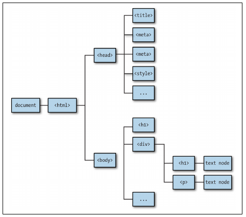
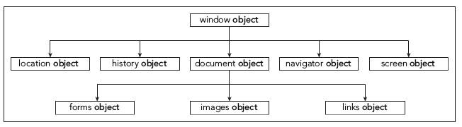

# Introducción a JavaScript

## 1. Un primer script.
Ver [documentación de referencia](https://uniwebsidad.com/libros/javascript/capitulo-2)

## 2. Variables en JavaScript


```
VAR: Ámbito global o función (si se definió en una función)

var a // typeof a == 'undefined'
----
var a = 1
var a = 2 // redeclaración
----
var a = 1, b = 2 // declaración en una línea
--------------------

LET: Ámbito limitado al bloque en que se define.

let color = 'red' // ámbito limitado al bloque
--------------------

CONST: Ámbito limitado a bloque (como let). Define constantes.

const a = 'test'
```

> Para indicar el tipo de una variable al IDE (Webstorm) podemos indicarlo así:     
```
/** @param {Tipo} nombreVariable */
```

## 3. Tipos primitivos


```
- Numbers
    - Integers
        10
        25323423421
        0xCC // hex
    - Floats
        3.14
        .1234
        5.2e4
- Strings
    - 'A string'
    - "A string"
    - "A \
    string"
    - "A " +
    "string"
    - 'I\'m a developer'
    `A string with ${something}`
- Booleans
    - == o !=
    - === o !==
    - <
    - >
    - if y while soportan booleanos extendidos:
        - Falsos extendidos: 0, -0, NaN, undefined, null, ''
        - Verdaderos extendidos : cualquier otra cosa.
- null (indica ausencia de valor)
- undefined (variable no inicializada)
```

## 4. Expresiones


```
Expresiones aritméticas = que en php: + - / * %

```


## 5. Funciones
Las funciones en JavaScript tienen el mismo aspecto que en otros lenguajes.


```
//----------------- CODE SAMPLE ---------------------

function calculaPrecioTotal(precio, porcentajeImpuestos) {
  var gastosEnvio = 10;
  var precioConImpuestos = (1 + porcentajeImpuestos/100) * precio;
  var precioTotal = precioConImpuestos + gastosEnvio;
  return precioTotal.toFixed(2);
}

//---------------------------------------------------
```

## 6. DOM

DOM es una convención para describir la estructura de un documento HTML. DOM es un árbol de nodos (padres/hijos).



### Imprimir el DOM

```
//----------------- CODE SAMPLE ---------------------
function printDOM(node, prefix) {
    console.log(prefix + node.nodeName);
    for(let i=0; i<node.childNodes.length; i++) {
        printDOM(node.childNodes[i], prefix + '\t');
    }
}
printDOM(document, '');
//---------------------------------------------------
```

### Obtener un elemento por id, clase o etiqueta


```
//----------------- CODE SAMPLE ---------------------
document.getElementById('content');

document.getElementsByClassName('callout');

document.getElementsByTagName('p');

//---------------------------------------------------
```

*getElementById* devuelve un elemento de tipo [HTMLElement](https://developer.mozilla.org/en-US/docs/Web/API/HTMLElement)

*getElementsByName* devuelve un elemento de tipo [NodeListOf<Element>](https://developer.mozilla.org/en-US/docs/Web/API/NodeList)

*getElementsBy...* devuelve un elemento de tipo [HTMLCollectionOf<Element>](https://developer.mozilla.org/en-US/docs/Web/API/HTMLCollection)

### Manipulación de elementos DOM

```
//----------------- CODE SAMPLE ---------------------
const para1 = document.getElementsByTagName('p')[0];

para1.textContent; // CONTENIDO
para1.innerHTML; // CONTENIDO CON ETIQUETAS HTML
para1.textContent = "Modified HTML file"; // CAMBIO
para1.innerHTML = "<i>Modified</i> HTML file"; // CAMBIO
//---------------------------------------------------
```


### Creación de nuevos elementos

```
//----------------- CODE SAMPLE ---------------------
const p1 = document.createElement('p');
const p2 = document.createElement('p');
p1.textContent = "I was created dynamically!";
p2.textContent = "I was also created dynamically!";

const parent = document.getElementById('content');
const firstChild = parent.childNodes[0];

parent.insertBefore(p1, firstChild);
parent.appendChild(p2);
//---------------------------------------------------
```

### Insertar delante de un elemento

```
//----------------- CODE SAMPLE ---------------------

var insertedElement = parentElement.insertBefore(newElement, referenceElement);

//---------------------------------------------------
```

### Insertar detrás de un elemento

```
//----------------- CODE SAMPLE ---------------------

nodoReferencia.parentNode.insertBefore(nuevoNodo,nodoReferencia.nextSibling);

//---------------------------------------------------
```

### Insertar al principio de una lista

```
//----------------- CODE SAMPLE ---------------------

var nuevoItem = document.createElement("li");       
var nodoTexto = document.createTextNode("Contenido del ítem");  
nuevoItem.appendChild(nodoTexto);                    
var lista = document.getElementById("idLista");    
lista.insertBefore(nuevoItem, lista.childNodes[0]);

//---------------------------------------------------
```

### Acceso a los atributos

#### Crear un atributo

```
//----------------- CODE SAMPLE ---------------------
var miParrafo = document.getElementById("parrafo1");
miParrafo.setAttribute("draggable","true");
//---------------------------------------------------
```

#### Eliminar un atributo

```
//----------------- CODE SAMPLE ---------------------
var miParrafo = document.getElementById("parrafo1");
miParrafo.removeAttribute("draggable");
//---------------------------------------------------
```

#### Acceder a un atributo

```
//----------------- CODE SAMPLE ---------------------
var miParrafo = document.getElementById("parrafo1");
var atributoDraggable = miParrafo.getAttribute("draggable");
//---------------------------------------------------
```

#### Acceso a todos los atributos

```
//----------------- CODE SAMPLE ---------------------
var misH1 = document.getElementsByTagName("H1");
   var eh1 = misH1[0];
           
    for (var i=0;i<eh1.attributes.length;i++){
        var attN = eh1.attributes[i].nodeName;
        var attV = eh1.attributes[i].nodeValue;
        alert("El atributo es :" + attN + " = " + attV);
    }
//---------------------------------------------------
```

#### Acceso a formularios, imágenes y enlaces (BOM)



```
var miImagen2 = document.images[1];
var miFormulario1 = document.forms[0];
var miPrimerEnlace = document.links[0];
```

### Eventos

#### Usando la información del evento

```
//----------------- CODE SAMPLE ---------------------

<!doctype html>
<html>
<head>
</head>

    <body>
        <h1 id="titulo">Pasa el ratón por encima</h1>
        <p id="citas">Haz clic aquí</p>

        <script type="text/javascript">
            var textos=["Supercalifragilísticoespialidoso",
                        "Había una vez un circo...",
                        "En un lugar de la Mancha"];
            function textoAleatorio(event){
                if (event.type == "click"){
                    alert("Has hecho clic");
                } else if (event.type == "mouseover"){
                    alert("Has pasado el ratón por encima");
                }
                var numeroAleatorio = Math.round(Math.random()*2);
                var elemento = event.target;
                elemento.innerHTML = textos[numeroAleatorio];
            }

            var parrafo = document.getElementById("citas");
            var titulo = document.getElementById("titulo");
            parrafo.addEventListener("click",textoAleatorio);
            titulo.addEventListener("mouseover",textoAleatorio);
        </script>
    </body>
</html>
//---------------------------------------------------
```
```
//----------------- CODE SAMPLE ---------------------

// En este script se utiliza la información que se pasa al evento.

<!doctype html>
<html>
<head>

    <style type="text/css">
    
        .muy_destacado{
            color:red;
            font-weight:bolder;
        }
        
        .borde_destacado{
            border:5px solid red;
        }
    </style>
</head>

    <body>

        <h1>Probando con eventos</h1>
        <p class="destacado">Esto es un texto</p>
        
        
        <script>
            function destacar(event){
                var objetoActivado = event.target;
                var tipoEvento = event.type;
                
                if ((objetoActivado.tagName == "P") && (tipoEvento == "click")) {
                    if (objetoActivado.className.indexOf("muy_destacado") != -1 ){
                        objetoActivado.className = "";
                    } else {
                        objetoActivado.className = "muy_destacado borde_destacado";
                    }
                }
                else if (objetoActivado.tagName == "H1"){
                    if (tipoEvento == "mouseover"){
                        objetoActivado.className = "muy_destacado";
                    }
                    if (tipoEvento == "mouseout"){
                        objetoActivado.className = "";
                    }   
                }
                else if ((objetoActivado.tagName == "IMG") && (tipoEvento == "click")){
                    objetoActivado.className = "borde_destacado";
                }
            }
            
            document.addEventListener("click",destacar);
            document.addEventListener("mouseover",destacar);
            document.addEventListener("mouseout",destacar);
        </script>

    </body>
</html> 
//---------------------------------------------------
```
#### Varios manejadores en serie

Se pueden definir varios manejadores para un mismo elemento, de forma que se ejecutarán uno a uno. Por ejemplo, observa el siguiente código

```
//----------------- CODE SAMPLE ---------------------
<!doctype html>
<html>
<head>
</head>

    <body>
        <h1 id="titulo">Haz clic en la imagen</h1>
        

        <script type="text/javascript">
            var imagenes = ['imagen1.jpg',
                            'imagen2.jpg',
                            'imagen3.jpg',
                            'imagen4.jpg'];
            
            var colores = ['red', 
                           'green', 
                           'blue', 
                           'yellow'];
            
            function imagenAleatoria(event){
                var numeroAleatorio = Math.round(Math.random()*3);
                var imagen = event.target;
                imagen.src = imagenes[numeroAleatorio];
            }
            
            function bordeAleatorio(event){
                var numeroAleatorio = Math.round(Math.random()*3);
                var imagen = event.target;
                imagen.style.width = "300px";
                var border = "10px solid "+colores[numeroAleatorio];
                imagen.style.border=border;
            }

            var imagen = document.getElementById("imagen");
            imagen.addEventListener("click",imagenAleatoria);
            imagen.addEventListener("click",bordeAleatorio);
        </script>
    </body>
</html>
//---------------------------------------------------
```

#### Eliminar manejadores

Imaginemos que queremos que un cierto evento se gestione bajo una cierta condición, pero que bajo otra condición diferente ya no se debe seguir gestionando. El ejemplo siguiente se realiza un cambio de imagen y de borde al hacer clic sobre la imagen, hasta que se hace clic sobre un botón que detiene este comportamiento:

```
//----------------- CODE SAMPLE ---------------------
<!doctype html>
<html>
<head>
</head>

    <body>
        <h1 id="titulo">Haz clic en la imagen</h1>
        
        <button id="boton">No cambiar la imagen</button>
        <script type="text/javascript">
            var imagenes = ['imagen1.jpg',
                            'imagen2.jpg',
                            'imagen3.jpg',
                            'imagen4.jpg'];
            
            var colores = ['red', 
                           'green', 
                           'blue', 
                           'yellow'];
            
            var imagen = document.getElementById("imagen");
            
            function imagenAleatoria(event){
                var numeroAleatorio = Math.round(Math.random()*3);
                imagen.src = imagenes[numeroAleatorio];
            }
            
            function bordeAleatorio(event){
                var numeroAleatorio = Math.round(Math.random()*3);
                imagen.style.width = "300px";
                var border = "10px solid "+colores[numeroAleatorio];
                imagen.style.border=border;
            }
            
            function detenerImagenAleatoria(event){
                imagen.removeEventListener("click",imagenAleatoria);
            }

            imagen.addEventListener("click",imagenAleatoria);
            imagen.addEventListener("click",bordeAleatorio);
            
            var boton = document.getElementById("boton");
            boton.addEventListener("click",detenerImagenAleatoria);
        </script>
    </body>
</html>
//---------------------------------------------------
```

Como se puede ver, para éliminar los manejadores se utiliza el método removeEventListener. Al hacer clic en el botón, se elimina el gestor de eventos imagenAleatoria, pero no se elimina bordeAleatorio, de modo que seguirá cambiando el borde, pero no la imagen.

## 7. Arrays


```
//----------------- CODE SAMPLE ---------------------
const a = []
const a = [1, 2, 3]
const a = Array.of(1, 2, 3)
const a = Array(6).fill(1) //init an array of 6 items of value 1
a.length
---------------------
NOTACIÓN OBSOLETA:
    const a = new Array()
    const b = new Array(1,2,3)
---------------------
a.push(4) // añadir al final
a.push(4,5) // añadir al final dos números
a.unshift(4) // añadir al principio
a.unshift(4,5) // añadir al princio 4 y 5
---------------------
a.pop() // borrar el elemento del final
a.shift() // eliminar el elemento del principio
---------------------
const c = a.splice(0,2) // elimina los dos primeros elementos y los devuelve como array
---------------------
const c = a.concat(b) // concatena a y b lo devuelve.
---------------------
a.indexOf(3)
a.lastIndexOf(3)
---------------------
var found = array.find(function(e){return e > 20})
---------------------
var foundIndex = array.findIndex(function(e){return e == 2})
---------------------
a.includes(2) // incluye el 2
a.includes(2,1) // incluye el 2 tras la posición 1 (incluida)
---------------------
a.slice(3,5) // devuelve el subarray desde la posición 3 a la 5
---------------------
a.sort((a,b) => {return a - b}) // ordena el array
---------------------
a.reverse() // ordena el array al revés
//---------------------------------------------------

```


# Actividades

> Para los ejercicios 1 y 2 necesitarás saber más sobre las expresiones regulares. Existen muchas referencias en Internet, aunque el siguiente enlace es bastante conciso y accesible: [Expresiones regulares según w3schools](https://www.w3schools.com/jsref/jsref_obj_regexp.asp)

-------------------

**Actividad 1.** El usuario ha rellenado un formulario de la página. Los campos del formulario son:

Nombre: letras minúsculas, mayúsculas, espacios en blanco y '.'.
Apellidos: letras minúsculas, mayúsculas y espacios en blanco.
Contraseña: letras, números, y caracteres especiales. Debe tener un mínimo de 5 caracteres.
DNI: tiene la forma 12345678A. Puede ir desde 1 hasta 99999999Z
Edad: un número entre 0 y 120
Correo electrónico: tiene la forma cualquiercosa@dominio.dom
Supongamos que hemos recogido los valores de dicho formulario y que se han almacenado en las siguientes variables: nombre, apellidos, password, dni, edad y email.

Escribe el código JavaScript necesario para que se cumplan las restricciones indicadas anteriormente. Al final se debe mostrar por pantalla un mensaje indicando los errores encontrados si es que hay, o bien el mensaje "no hay errores" si no los hubiera.

---------------------

**Actividad 2.** Copia el siguiente código fuente, y trabaja sobre él como punto de partida:


		<!doctype html>
		<html>
		<head>
		    <meta charset="UTF-8">
		    <title>Actividad 3</title>
		    <script type="text/javascript">
		        var nombre = "Sergey Brin";
		        var email = "sergey.brin@gmail.com";
		        var password = "Gato200!";
		        
		        function checkNombre(nombre){

		        }

		        function checkEmail(email){

		        }

		        function contarMayusculas(password){

		        }

		        function contarMinusculas(password){

		        }

		        function contarNumeros(password){

		        }

		        function contarSimbolos(password){

		        }

		        function checkPassword(password){

		        }

		        function mostrarCartel(texto){

		        }

				var mensajeNombre = checkNombre(nombre);
		        var mensajeEmail = checkEmail(email);
		        var mensajePassword = checkPassword(password);
		        
		        mostrarCartel(mensajeNombre);
		        mostrarCartel(mensajeEmail);
		        mostrarCartel(mensajePassword);
		    </script>
		</head>
		<body>


		</body>
		</html>
	
Imagina que el contenido de las variables nombre, email y password han sido leídas de los inputs de un formulario. Estas variables deben cumplir los siguientes requisitos:

- Los nombres de personas no pueden tener números ni símbolos de puntuación (.:_-!?).
- Las direcciones de email deben tener una única @, y el dominio debe tener la estructura siguiente: nombre.tld, como por ejemplo gmail.com
- Las contraseñas deben tener, al menos, un número, una mayúscula, una minúscula y un símbolo especial (.:_-!?)

Escribe un código en JavaScript que haga lo siguiente:

1. Si el nombre es válido, muestra un cartel con el texto "El nombre es válido". En caso contrario, muestra el mensaje "El nombre no es válido".
2. Si el email es válido, muestra un cartel con el texto "El email es válido". En caso contrario, muestra el mensaje "El nombre no es válido.
3. Muestra un cartel indicando la contraseña y el número de letras mayúsculas, minúsculas, números y símbolos especiales. Por ejemplo, la contraseña "Gato200!" mostraría el mensaje: 
```
"Gato200! -> Mayúsculas:1, Minúsculas:3, Números:3, Símbolos:1"
```

Para escribir el programa, debes utilizar las siguientes funciones:

- checkNombre toma el nombre y devuelve la cadena de texto "El nombre es válido" o bien la cadena "El nombre no es válido".
- checkEmail toma el email y devuelve la cadena de texto "El email es válido" o bien la cadena "El email no es válido"
- checkPassword toma la contraseña y devuelve una cadena de texto con el recuento de mayúsculas, minúsculas, símbolos y números. Esta función utiliza a su vez las funciones contarMayusculas, - contarMinusculas, contarNumeros y contarSimbolos para hacer el recuento.
- contarMayusculas toma la password y devuelve el número de mayúsculas.
- contarMinusculas toma la password y devuelve el número de minúsculas.
- contarNumeros toma la password y devuelve el número de números.
- contarSimbolos toma la password y devuelve el número de símbolos.
- mostrarCartel toma un texto y lo muestra por pantalla.

------------------

**Actividad 3.**  Disponemos de la siguiente página web:

```
<!doctype html>
<html>
<head>
    <meta charset="UTF-8">
    <title>Relato</title>
    <style type="text/css">
        .capitulo{
            font-family:sans-serif;
            color:red;
        }
        
        div.indice{
            border:1px solid black;
        }
        
        a.entradaIndice:hover{
            font-weight:bold;
        }
    </style>
</head>
<body>

    <h1 id="titulo">Dos por tres calles</h1>
    
    <h2 class="capitulo">Capítulo 1. La primera calle</h2>
    <p>Era una sombría noche del mes de agosto. Ella, inocente cual mariposa que surca el cielo en busca de libaciones...</p>

    <h2 class="capitulo">Capítulo 2. La segunda calle</h2>
    
    <p>Era una oscura noche del mes de septiembre. Ella, inocente cual abejilla que surca el viento en busca del néctar de las flores...</p>
    
    <h2 class="capitulo">Capítulo 3. La tercera calle</h2>

    <p>Era una densa noche del mes de diciembre. Ella, cándida cual abejilla que surca el espacio en busca de bichejos para comer...</p>
  
</body>
</html>	
```

Utilizando únicamente JavaScript, inserta en el documento un índice que contenga un enlace a cada una de las secciones del documento. El índice debe colocarse justo después del título principal del documento (\<h1>Dos por tres calles\<h1>) debe quedar como se indica en el siguiente código.


```
<div class="indice">
	<h2 style="text-align:center;">Índice del libro</h2>
	<ul>
		<li>
			<a href="#cap0" class="entradaIndice">Capítulo 1. La primera calle</a>
		</li>
		<li>
			<a href="#cap1" class="entradaIndice">Capítulo 2. La segunda calle</a>
		</li>
		<li>
			<a href="#cap2" class="entradaIndice">Capítulo 1. La tercera calle</a>
		</li>
	</ul>
</div>
```
Además debes añadir (también desde JavaScript) el atributo id a cada capítulo para que el enlace correspondiente del índice tenga un anclaje donde ir.

Si se añade una nueva sección al documento, la siguiente vez que se carge la página en el navegador.

-----------

**Actividad 4.** Escribe una página que muestre una imagen. Al hacer clic sobre la imagen, muestra la siguiente de un total de 5. Al llegar a la última, vuelve a mostrar la primera.

