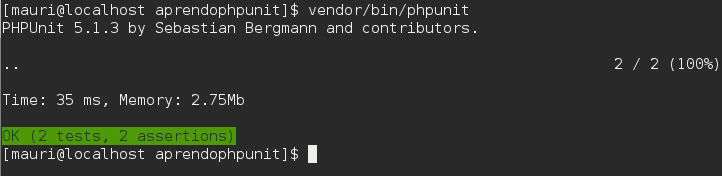

# PHPUnit

Se trata de una suite de pruebas. Se utiliza para comprobar que una parte del código funciona como debe. Una vez escrita una prueba, se puede volver a ejecutar tantas veces como se quiera, por lo que ayuda en la construcción del software a largo plazo.

## Instalar PHPUnit

PHPUnit es un framework utilizado para escribir tests en PHP. Podemos instalarlo de dos maneras diferentes:
Instar PHPUnit mediante Composer

Podemos utilizar Composer para instalar la última versión de PHPUnit. Es importante que PHPUnit sea un requisito de desarrollo, para que PHPUnit no se despliegue en el sistema en producción. El archivo composer.json correspondiente podría ser algo como lo siguiente:

```
{
    "require-dev":{
        "phpunit/phpunit":">=5.1.3-stable"
    }
}
```

Instalando mediante Composer, obtendremos PHPUnit como una dependencia del proyecto.

Para comprobar que todo ha ido bien, debemos ejecutar el siguiente comando dentro de la carpeta del proyecto:

vendor/bin/phpunit --version

## PHPUnit en un único archivo

PHPUnit también se puede instalar como un único archivo, que incluye todas sus dependencias. Para instalar dicho archivo, debemos seguir las instrucciones que se dan en https://packagist.org/packages/phpunit/phpunit

Para comprobar que todo ha ido bien, basta con ejecutar el siguiente comando:

```
phpunit --version
``` 

## Un primer ejemplo

Vamos a trabajar con un primer ejemplo. La estructura de nuestro proyecto es la siguiente:

```
aprendophpunit/index.php
aprendophpunit/modelo/Salario.php
composer.json
vendor/
```

Supongamos que el código que queremos probar, en la clase Salario (Salario.php), es el siguiente:

```
namespace aprendophpunit\modelo;
class Salario {
    public function incrementoSalario($salarioActual){
        return $salarioActual+$salarioActual*2/100;
    }
    
    public function retencionSalario($salarioBruto){
        return $salarioBruto*22/100;
    }
}
```

Para probar que todo es correcto, vamos en primer lugar a probar la clase en index.php. El contenido de index.php podría ser el siguiente:

```
<!DOCTYPE html>
<html>
    <head>
        <meta charset="UTF-8">
        <title></title>
    </head>
    <body>
        <?php
        require "vendor/autoload.php";
        use aprendophpunit\modelo\Salario;
        $salario = new Salario();
        echo "El aumento de salario es ".$salario->incrementoSalario(2000);
        ?>
    </body>
</html>
```

Veremos que esto falla, porque aún no hemos incluido la clase Salario en el autoload de Composer. Podemos modificar composer.json para que quede como en el siguiente ejemplo:

```
{
    "require-dev":{
        "phpunit/phpunit":">=5.1.3-stable"
    },
    "autoload":{
        "psr-4":{
            "aprendophpunit\\modelo\\":"modelo/"
        }
    }
}
```

Después de esto, actualizamos Composer como la opción dump-autoload. Después de esto debería funcionar nuestro pequeño proyecto.
Ubicación y nombre de los tests

Es importante la estructura de directorios que damos a nuestros tests. Lo ideal es que siguan una estructura similar a la que sigue el código probado, de esta forma podemos identificar claramente qué componente prueba un cierto test. De modo que si tenemos los siguientes archivos:

```
aprendophpunit/modelo/Salario.php
aprendophpunit/modelo/Controlador/Foo.php
```

Los archivos de test, podrían estructurarse del siguiente modo:

```
aprendophpunit/Test/modelo/SalarioTest.php
aprendophpunit/Test/modelo/Controlador/FooTest.php
Un primer test unitario
```

Vamos a crear un test para salario. Su contenido será el siguiente:

```
<?php

/*
 * To change this license header, choose License Headers in Project Properties.
 * To change this template file, choose Tools | Templates
 * and open the template in the editor.
 */

/**
 * Description of SalarioTest
 *
 * @author mauri
 */
/*
namespace aprendophpunit\Test\modelo;
require 'vendor/autoload.php';  // Esto es necesario para poder acceder a Salario.

use aprendophpunit\modelo\Salario;
class SalarioTest extends \PHPUnit_Framework_TestCase{
    
    
    public function testSalarioDevuelveIncremento20porciento(){
        $incremento20 = 2000*2/100;
        $salario = new Salario();
        $salarioObtenido = $salario->incrementoSalario(2000);
        $salarioEsperado = 2000 + $incremento20;
        $this->assertEquals($salarioEsperado,$salarioObtenido,"Los salarios son iguales.");
    }
    
    
    public function testRetencionSalario22porciento(){
        $retencionEsperada = 2000*22/100;
        $salario = new Salario();
        $retencionObtenida = $salario->retencionSalario(2000);
        $this->assertEquals($retencionEsperada,$retencionObtenida);
    }
}
```

En el ejemplo anterior podemos observar varias cuestiones:

### El nombre del caso de prueba

Un caso de prueba es una clase que agrupa un conjunto de pruebas unitarias. El nombre del caso de prueba (o test case) es igual que la clase que estamos probando, con la palabra TestCase al final.

```
PHPUnit_Framework_TestCase
```

Un caso de prueba hereda de la clase PHPUnit_Framework_TestCase

### Nombre de los tests unitarios

Los nombres de los tests unitarios son largos y descriptivos. Empiezan por la palabra "test", seguidos en notación camelCase de la descripción del test.
Ejecutar una suite de tests

Al conjunto de casos de prueba, se le llama siute de tests. Para poder ejecutar los tests, es preciso crear un archivo llamado phpunit.xml en la raíz del proyecto. El contenido será similar al siguiente:

```
<?xml version="1.0" encoding="UTF-8"?>
<phpunit colors="true">
    <testsuites>
        <testsuite name="Application Test Suite">
            <directory>./Test/</directory>
        </testsuite>
    </testsuites>
</phpunit>
```

Lo que hacemos en este archivo es:

- Indicar que se utilicen colores para indicar si el test ha sido positivo o negativo (verde/rojo).
- Indicar la ruta donde se encuentran los tests

Para ejecutar los tests, abrimos una terminal, y nos vamos hasta la raíz del proyecto. Allí ejecutamos el comando siguiente:

```
vendor/bin/phpunit
```

El resultado debería ser algo como lo siguiente:



## PHPUnit se integra con los IDE. PHPUnit en PHPStorm

Los entornos IDE se integran con PHPUnit de diferente manera según el entorno. En PHPStorm el framework se especifica en *File\Settings\Languages & Frameworks\PHP\Test Frameworks*. En este apartado se puede especificar la ubicación de *PHPUnit* de dos maneras:
- Utilizando *Composer* indicando la ruta del archivo *autoload.php*.
- Indicando la ruta al archivo *phpunit.phar* descargado directamente desde el sitio web del proyecto *PHPUnit*.

------------------------------

# Actividades con PHPUnit

Crea un proyecto de conversión de medidas similar al que creaste en el tema anterior. Sin embargo ahora deberás poner a prueba su funcionamiento, incluyen los casos límite. Las pruebas que debes realizar son las siguientes.:

- 1 inch = 2,54 cm
- 12 inch = 30,48 cm
- 12 cm = 4,72 inc
- 0 cm = 0 inch
- 0,5 cm = 1,9685 inch
- Límite superior 40 inch: 41 inch = ERROR
- Límite superior 40 inch: 104 cm = ERROR
- Límite superior 101,6 cm: 101,6 cm = ERROR

-------------------------------

# Selenium y webdriver

Para trabajar con Selenium necesitamos como mínimo dos componentes:

- Un servidor Selenium. En la página de descargas podemos encontrarlo en la sección "Selenium Standalone Server".
- Un driver para poder comunicarnos con el servidor Selenium y enviarle comandos. Este driver aparece en forma de librería en un cierto lenguaje (en nuestro caso PHP).

A estos componentes podemos añadir otros dos más, que no son necesarios pero nos harán la vida más agradable:

- Una librería para automatizar pruebas (en nuestro caso PHPUnit)
- Un IDE (en nuestro caso PhpStorm)

Vamos a suponer que tenemos un script que hace una prueba sobre nuestra aplicación usando un webdriver para Selenium. El proceso que vamos a seguir al ejecutar un test con Selenium es el siguiente:

- El webdriver establece una conexión con el servidor Selenium
- El servidor Selenium hace lo siguiente:
    - Crea una sesión para la solicitud
    - Lanza el navegador deseado
    - Carga en el navegador las librerías JavaScript necesarias para poder llevar a cabo las acciones que se pidan desde el script (acciones en lenguaje Salenese)
- El webdriver realiza una traducción de las acciones escritas en un test (en nuestro caso en PHP) a Salenese, y se las envía al servidor Selenium.
- El servidor interpreta las acciones Salenese y planifica cada script JavaScript necesario para lanzar la acción correspondiente (como por ejemplo, rellenar un campo de texto con el texto "Hola mundo").
- A partir de este momento, el servidor Selenium actúa de intermediario entre el navegador lanzado y el servidor web que aloja la aplicación que estamos probando. De esta forma, se creará una conversación entre el navegador y al aplicación, en la que el servidor Selenium añade añade las acciones pedidas en el script.
- Finalmente, una vez que el servidor Selenium tenga la respuesta definitiva desde el servidor web, enviará la respuesta al script que inició el proceso.


## Instalar Selenium

Descargar Selenium desde  [https://www.selenium.dev/downloads/](https://www.selenium.dev/downloads/) e instalarlo. Si descargamos la versión de *java*, neceistaremos también instalar jdk. Para arrancar el servidor *Selenium* ejecutaremos el siguiente comando:

```
java -jar selenium-server-standalone-x.xx.x.jar
```

Tras ejecutar el comando anterior, podemos obtener una salida como la siguiente:

```
20:04:08.850 INFO [GridLauncherV3.parse] - Selenium server version: 3.141.59, revision: e82be7d358
20:04:08.910 INFO [GridLauncherV3.lambda$buildLaunchers$3] - Launching a standalone Selenium Server on port 4444
2020-02-26 20:04:08.955:INFO::main: Logging initialized @284ms to org.seleniumhq.jetty9.util.log.StdErrLog
20:04:09.170 INFO [WebDriverServlet.<init>] - Initialising WebDriverServlet
20:04:09.261 INFO [SeleniumServer.boot] - Selenium Server is up and running on port 4444
```


## Instalar *php-webdriver/webdriver* en el proyecto

Para poder enviar solicitudes a *Selenium* desde un test, instalamos la librería *php-webdriver/webdriver*, que contiene un conjunto de métodos que se pueden utilizar en PHP. Esto se puede llevar a cabo fácilmente mediante *Composer*. En [Packagist.org](https://packagist.org/packages/php-webdriver/webdriver) se puede comprobar la última versión disponible. Esta versión puede ser añadida en *composer.json* como una dependencia de desarrollo.

> Puede que tengamos algunos problemas para instalar *webdriver* debido a sus dependencias. En concreto, *webdriver* necesita los módulos de php *php-curl* y *php-zip*. En caso de que el sistema no cuente con estos módulos, será necesario instalarlos.

## Los drivers de los navegadores

Los navegadores ofrecen APIs para poder ejecutar las acciones sobre el navegador, como por ejemplo seleccionar un elemento, hacer clic o escribir algo. Es necesario que contemos con estos drivers. Si por ejemplo deseamos utilizar *Google Chrome* debemos descargar el driver desde [https://chromedriver.chromium.org/downloads](https://chromedriver.chromium.org/downloads). Si en cambio deseamos utilizar Firefox, lo podemos descargar desde [https://github.com/mozilla/geckodriver/releases](https://github.com/mozilla/geckodriver/releases). Estos drivers deben estar ubicados en la misma carpeta que el servidor *Selenium*.

## Crear un test para Selenium

El siguiente test comprueba que el título de la página principal de *GitHub* contiene el texto "GitHub".

```
?php
require('vendor/autoload.php');

use PHPUnit\Framework\TestCase;

class GitHubTest extends \PHPUnit\Framework\TestCase {

    /**
     * @var \RemoteWebDriver
     */
    protected $webDriver;

	public function setUp()
    {
        $capabilities = array(\WebDriverCapabilityType::BROWSER_NAME => 'chrome');
        $this->webDriver = RemoteWebDriver::create('http://localhost:4444/wd/hub', $capabilities);
    }

    protected $url = 'https://github.com';

    public function testGitHubHome()
    {
        $this->webDriver->get($this->url);
        // chequeamos que el titulo contenga 'GitHub'
        $this->assertContains('GitHub', $this->webDriver->getTitle());
    }    
```

## Cosas que se pueden hacer con WebDriver

En [https://github.com/php-webdriver/php-webdriver/wiki/Example-command-reference](https://github.com/php-webdriver/php-webdriver/wiki/Example-command-reference) se puede encontrar una diferencia a los comandos de WebDriver.

A continuación se muestra un ejemplo donde se se comprueba el funcionamiento de un conversor de temperaturas Celsius/Farenheit

El documento html sobre el que se harán las pruebas es el siguiente:

```
<!DOCTYPE html>
<html lang="en">
<head>
    <meta charset="UTF-8">
    <title>Medidas</title>
</head>
<body>
<input type="text" id="txt_temperatura"><button id="btn_calcular">Calcular</button><br>
Celsius a Farenheit <input type="radio" name="conversion" id="rad_celsius_a_farenheit" value="farenheit"><br>
Farenheit a Celsius <input type="radio" name="conversion" id="rad_farenheit_a_celsius" value="celsius"><br>
<div id="div_resultado"></div>
<script type="text/javascript">
    var btnCalcular = document.getElementById("btn_calcular");
    btnCalcular.addEventListener("click",function(e){
       let valor = document.getElementById("txt_temperatura").value;
       let unidad_objetivo = "";
       let btns_radio = document.getElementsByName("conversion");
       for (let i=0; i<btns_radio.length; i++)
           if (btns_radio.item(i).checked)
               unidad_objetivo = btns_radio.item(i).value;
       console.log("valor: " + valor + "; unidad_objetivo: " + unidad_objetivo);
       let xhReq = new XMLHttpRequest();
       xhReq.open("POST","app.php");
       xhReq.onreadystatechange = function(){
           if ((xhReq.status==200) && (xhReq.readyState ==4)){
               console.log(xhReq.response);
               let result = JSON.parse(xhReq.response);
               if (result.estado == 'ok')
                    document.getElementById("div_resultado").innerText = result.resultado;
               else
                   document.getElementById("div_resultado").innerText = "Error";
           }
       }
       xhReq.send(JSON.stringify({unidad_objetivo:unidad_objetivo, valor:valor}));
    });
</script>
</body>
</html>
```

El test realizado es el siguiente:

```
<?php

use PHPUnit\Framework\TestCase;
use \Facebook\WebDriver\Remote\RemoteWebDriver;
use \Facebook\WebDriver\Remote\DesiredCapabilities;
use \Facebook\WebDriver\Remote\WebDriverCapabilityType;
use \Facebook\WebDriver\WebDriver;
use \Facebook\WebDriver\Remote\RemoteWebElement;
use \Facebook\WebDriver\WebDriverBy;

class Test extends TestCase
{
    protected $webDriver;
    
    protected function setUp(): void
    {
        $this->webDriver = RemoteWebDriver::create('http://localhost:4444/wd/hub',array(WebDriverCapabilityType::BROWSER_NAME => 'firefox'));
    }

    protected function tearDown(): void
    {
        $this->webDriver->close();
    }

    public function testFarenheitToCelsius(){
        $this->webDriver->get("http://localhost/actividad_phpunit/medidas.html");
        $this->webDriver->findElement(WebDriverBy::id("txt_temperatura"))->click();
        $this->webDriver->getKeyboard()->sendKeys("0");

        $this->webDriver->findElement(WebDriverBy::id("rad_farenheit_a_celsius"))->click();
        $this->webDriver->findElement(WebDriverBy::id("btn_calcular"))->click();

        $resultado = $this->webDriver->findElement(WebDriverBy::id("div_resultado"))->getText();

        $this->assertEquals(-17.78,floor($resultado*100)/100);
    }
}

```


